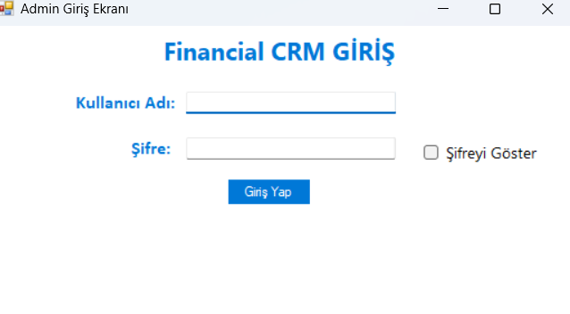
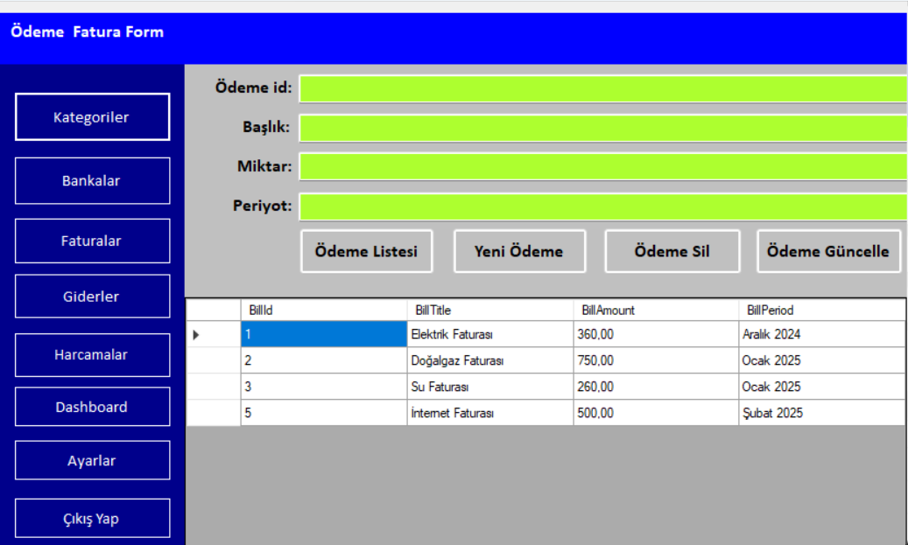

# 🚀 C# Eğitim Kampı ve Projeler

Bu repo, C# dilini öğrenme sürecimde gerçekleştirdiğim projeleri ve çeşitli teknolojilerle geliştirdiğim uygulamaları içermektedir. Murat Yücedağ'ın eğitmenliğinde gerçekleştirilen C# Eğitim Kampı'na katıldım ve farklı konularda projeler geliştirdim. Bu projeler, C# dilinin temel ve ileri seviye konularını öğrenmemi sağladı.

## 📋 Projeler

## 🛠️ Kullanılan Teknolojiler ve Araçlar

### ✨ C# ile Dapper Kullanımı
📌 **Amaç**: C# ile Dapper ORM kullanarak veritabanı işlemleri gerçekleştirmek.

✔️ **Kazanımlar**:
- Dapper ile hızlı ve verimli veri erişimi.
- SQL sorgularını optimize etme.

### ✨ C# ile MongoDB Kullanımı
📌 **Amaç**: NoSQL veritabanı MongoDB ile C# üzerinden veri işlemleri yapmak.

✔️ **Kazanımlar**:
- MongoDB bağlantısı kurma.
- Belge tabanlı veritabanı işlemleri.

### ✨ C# ile PostgreSQL Kullanımı
📌 **Amaç**: C# ile PostgreSQL veritabanına bağlanarak SQL işlemleri yapmak.

✔️ **Kazanımlar**:
- PostgreSQL bağlantısı ve sorgu çalıştırma.
- Veritabanı yönetimi ve optimizasyon.

### ✨ Finansal CRM Uygulaması
📌 **Amaç**: Finansal işlemleri yönetebileceğiniz bir CRM uygulaması geliştirmek.

✔️ **Kazanımlar**:
- Kullanıcı yönetimi ve işlemleri izleme.
- Veritabanı tasarımı ve Entity Framework kullanımı.
- C# ile güçlü bir kullanıcı arayüzü ve iş mantığı oluşturma.

---

## 📷 Ekran Görüntüleri

---

Bu projeler, hem temel hem de ileri seviye C# becerilerimi geliştirmeme yardımcı oldu. Ayrıca Dapper, MongoDB, PostgreSQL gibi teknolojilerle veritabanı işlemlerinde deneyim kazandım. Eğer daha fazla bilgi edinmek isterseniz, benimle iletişime geçebilirsiniz! 😊

---
